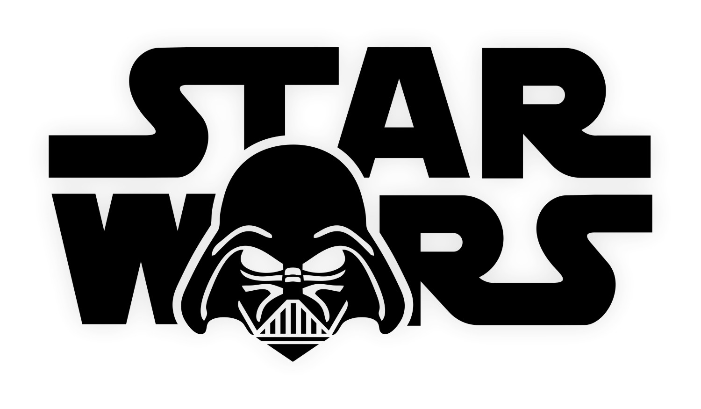
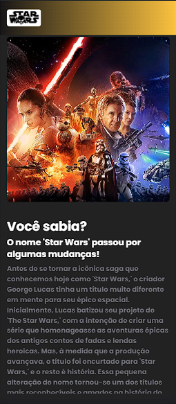
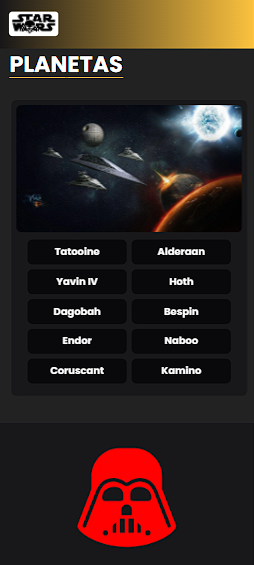
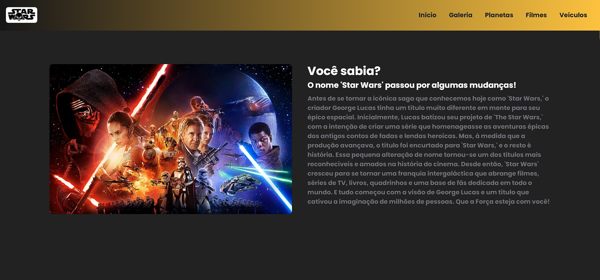
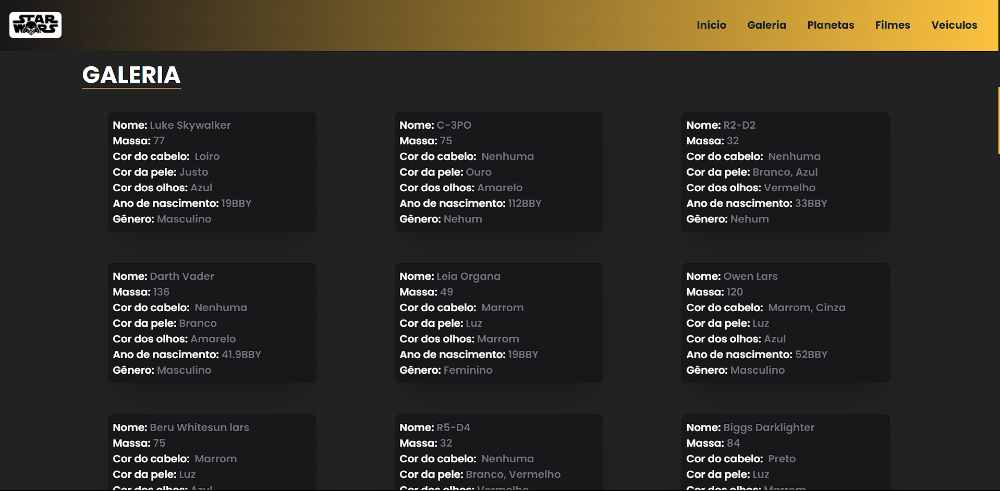
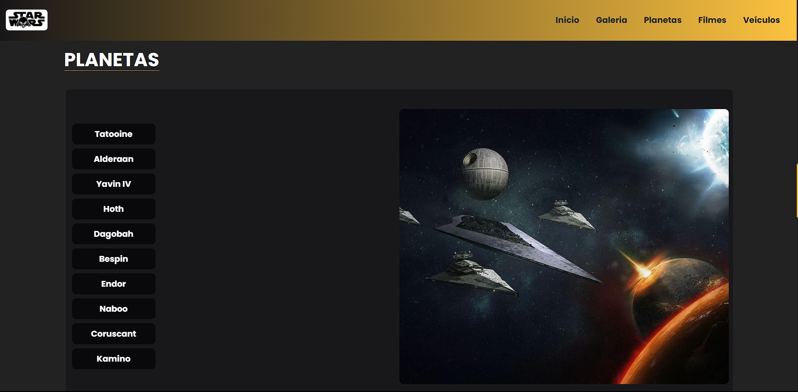
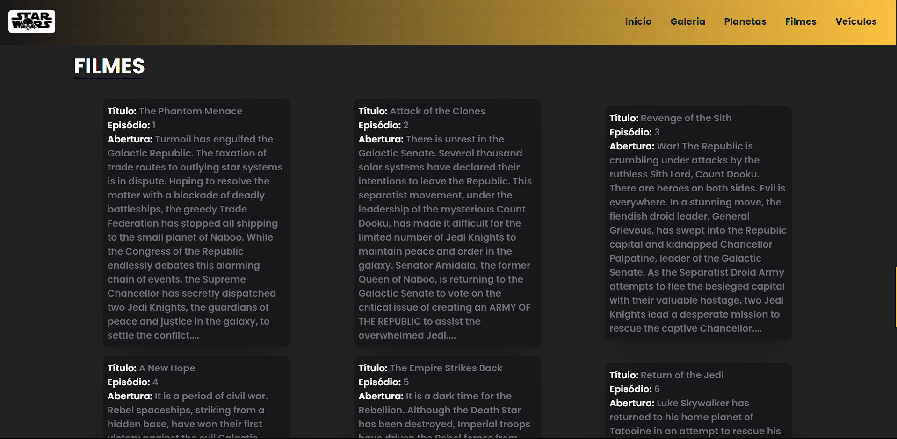
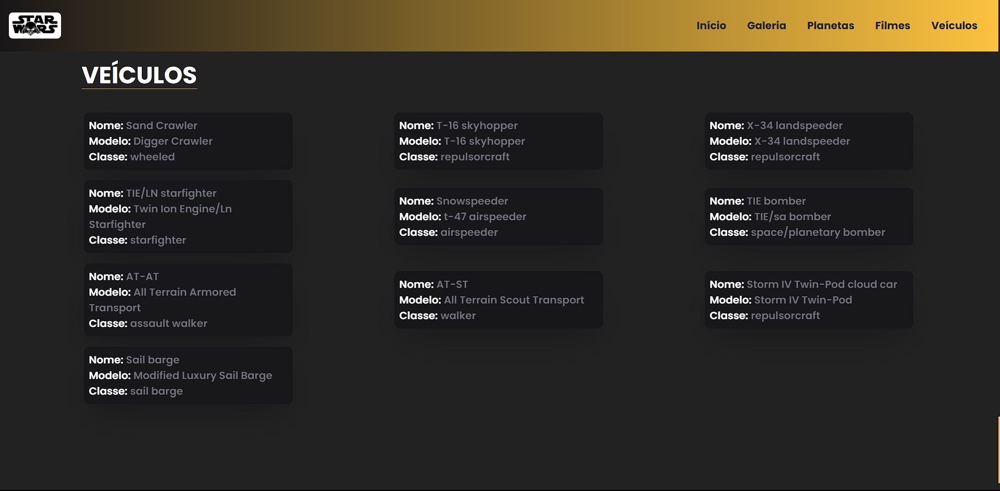

</h1>
   
<h1>Star Wars</h1>
<h2>Workshop Front-End-2023.2</h2>

## Descrição
### Desafio do Workshop Front-End-2023.2 da Fabrica de Software
#### REGRAS:

1. O imersionista deve realizar o seu próprio código e poderá, caso seja necessário, basear-se em vídeos no Youtube e em documentações (obs.: basear-se não é copiar o código);
2. Caso haja convergência entre layout e/ou códigos entre os imersionistas, poderá ocasionar na sua eliminação;
3. O uso do ReactJS é opcional. O imersionista é livre para utilizar qualquer biblioteca.
4. Ao final, o imersionista deverá criar um repositório no github com o seguinte nome: workshop-frontend-2023.2. Após isso, commitar o código e compartilhar o repositório nesse link: https://forms.gle/Wvq7N4Fqa6usFNM18
5. É recomendável que o arquivo README seja criado e mantido atualizado, pois ele é um requisito obrigatório para garantir a compreensão e acessibilidade do projeto.
6. O imersionista poderá fazer o deploy do site com o Vercel, ou qualquer outra plataforma.
7. Por fim, atente-se à organização: o uso de boas práticas, organização entre pastas e componentes e a refatoração do código é de extrema importância, visto que o seu código será avaliado. Logo, focar nesses pontos fará com que você tenha uma boa impressão.

#### REQUISITOS:

1. Um header que contenha no mínimo a opção de **INÍCIO e GALERIA.**
2. Inicio (Fácil):
    1. A estilização fica de acordo com a escolha do imersionista;
    2. Para a seção de início, você pode inserir curiosidade sobre Star Wars.
3. Galeria (Médio):
    1. É necessário consumir a API e exibir os elementos de Star Wars na tela.
    2. O imersionista deve construir um Card, que seja mostrado: `name, mass, hair_color, skin_color, eye_color, birth_year, gender`

[Ver Projeto](https://star-wars-renovatt.vercel.app/)

#

## Layout mobile

## Layout web
 

 

## 🛠️ Tecnologias

💻 **Front-end**
- [Next.js 13.4](https://nextjs.org)
- [Typescript](https://www.typescriptlang.org)
- [Swapi-API](https://swapi.dev/api/people)

📚 **Bibliotecas**
- [aos-animate ](https://michalsnik.github.io/aos/)
- [react-query](https://tanstack.com/query/latest/docs/react/overview)
- [react-icons](https://react-icons.github.io/react-icons/)

🎨 **Estilização**
- [tailwindcss](https://tailwindcss.com/docs/installation)

🔋 **Versionamento e Deploy**
- [Git](https://git-scm.com)
- [Vercel](https://vercel.com/)

 

⚙️ **Configuranções e Instalações**

Clone do Projeto

    $ git clone https://github.com/renovatt/workshop-frontend-2023.2.git

Instalando as dependências

    $ npm install

Iniciando o projeto

    $ npm run dev

 

**Como contribuir?**

- Você pode dar suporte me seguindo aqui no GitHub
- Dando uma estrela no projeto
- Criar uma conexão comigo no linkedin fazendo parte da minha networking e curtir o meu projeto.

 

**Autor**
[Wildemberg Renovato de Lima](https://www.linkedin.com/in/renovatt/)